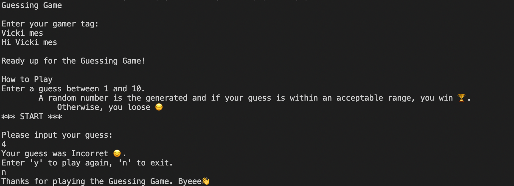

# Guessing Game

This is a play ground project to learn rust. It is a simple CLI game where a user guesses a random
number within a range.

## Setup

- Install [Rust language](https://www.rust-lang.org/tools/install).
- Build the project with [Cargo](https://doc.rust-lang.org/cargo/getting-started/installation.html)  

        Cargo build
- Run the game:

        ./target/debug/guessing_game

## Sample

